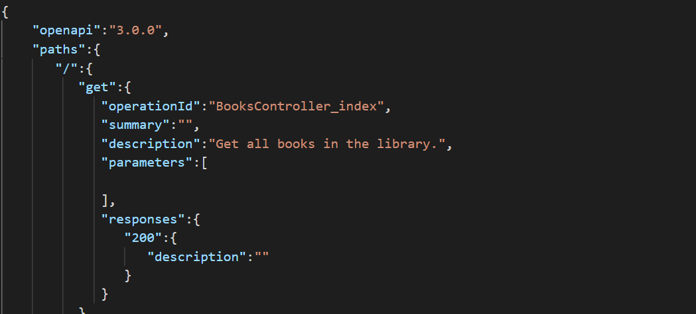

&nbsp;

Experienced application developer working as a consultant to help my clients find simplicity and consistency in solutions to their complex problems regardless of industry. I am eager to jump in and tackle any challenge and love to learn along the way. My focus is on agile methodology, user experience, and cloud development.

&nbsp;

          

# What am I up to?

- Working on an application to automate importing  documentation into . This will allow me to build a fully automated pipeline that will start from making a change in a controller action and building the swagger documentation, to then import that swagger documentation into postman and build integration tests within postman that can then be scheduled to run periodically. This application is written in .
- Starting a deep-dive into  to fill in holes in my knowledge with the help of .

# Projects

<table width="100%" style="text-align:center">
 <tr>
    <td width="50%">
      
<a href="https://github.com/chelseahouser/swaggerToPostman"><b style="font-size:30px">Swagger To Postman</b></a>

      
      
This application will take in a swagger url and create/update a postman collection based on the API definition. From there, this application will build up some basic integration tests for automated pipelines.

   </td>
    <td>
      
<a href="https://github.com/chelseahouser/website"><b style="font-size:30px">Portfolio Website</b></a>

      
      
This is a personal website to check out how building a site with Firebase works. I intend to use this site for demonstrating my portfolio as well as building up a blog with articles based on my experience and neat technologies I have worked on.

   </td>
 </tr>
  <tr>
    <td width="50%">
      
<a href="https://github.com/chelseahouser/home-library"><b style="font-size:30px">Home Library</b></a>

      
      
Yes, another library app. This application is a simple NestJS API that I use to build up a catalog of all my books. With this API I can track where my books are, what notes or reviews I have of them, and import them into my website to publish what I am reading.

    </td>
    <td>
      
<a href=""><b style="font-size:30px">More to Come...</b></a>

      
As I continue to learn and grow as a developer, a life long process, there will be more projects I can spotlight here.

   </td>
 </tr>
</table>

# Contact Me

   
