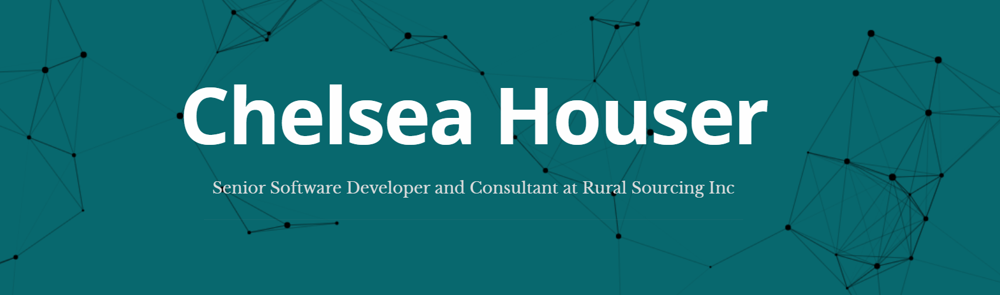

Experienced application developer working as a consultant to help my clients find simplicity and consistency in solutions to their complex problems regardless of industry. I am eager to jump in and tackle any challenge and love to learn along the way. My focus is in agile methodology, user experience, and cloud development.

    

- 🔭 I’m currently working on an application to automate importing  documentation into . 
- 🌱 I’m currently learning Devops in . 
- 📫 How to reach me: chelsearhouser@gmail.com 

   
