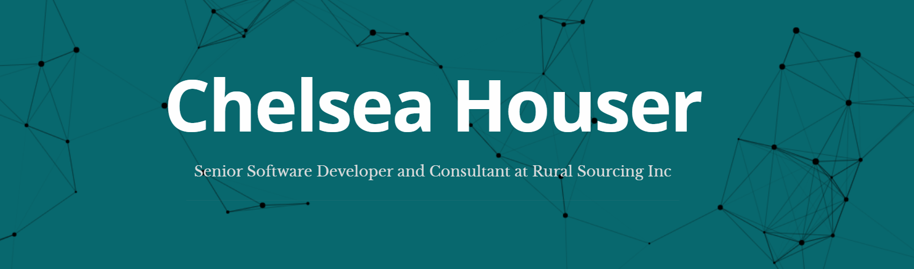
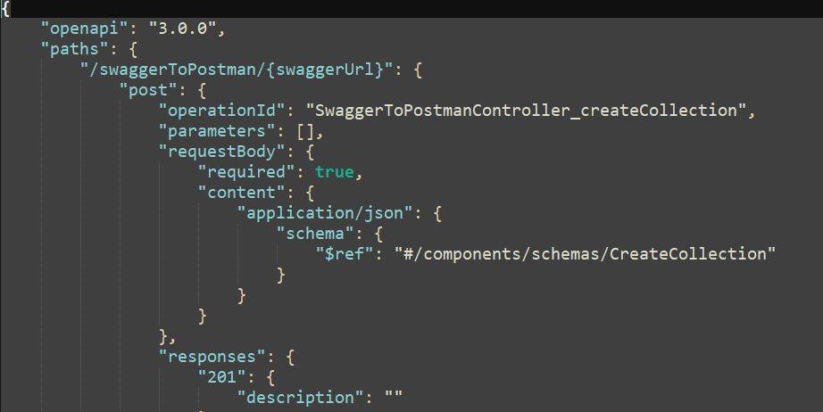
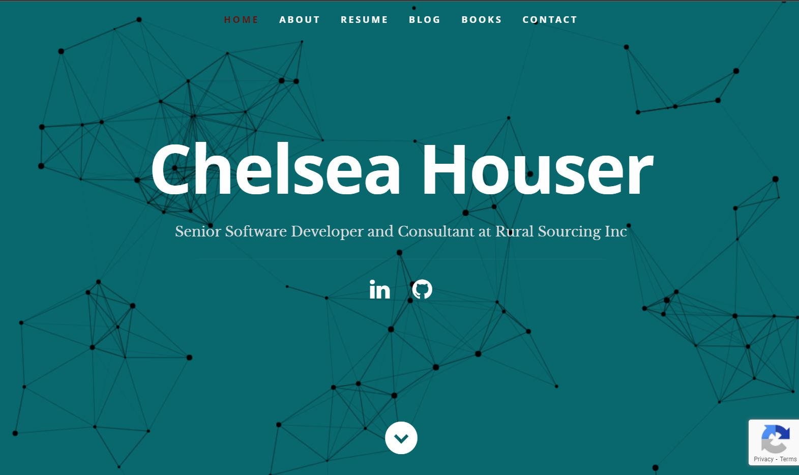
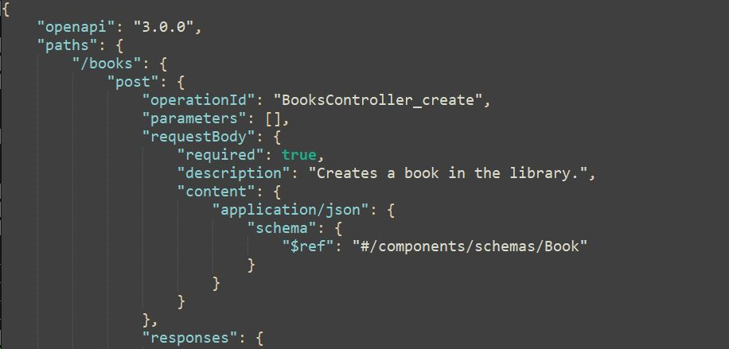
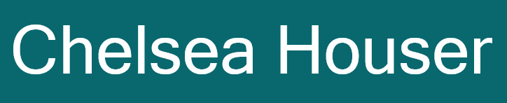

&nbsp;

Experienced application developer working as a consultant to help my clients find simplicity and consistency in solutions to their complex problems regardless of industry. I am eager to jump in and tackle any challenge and love to learn along the way. My focus is in agile methodology, user experience, and cloud development.

&nbsp;

         

&nbsp;

<h1>What am i up to?</h1>

- Working on an application to automate importing  documentation into . This will allow me to build a fully automated pipeline from making a change in a controller action -> building the swagger documentation -> importing that swagger documentation into postman -> building integration tests within postman -> schedule the integration tests to run periodically.
- Learning Devops in . My current client is a heavy user of GCP and improving my knowledge of the structure will allow me to work more efficiently to help my client out. I hope to use my skills to improve the
- Refreshing my knowledge of  with the help of . Regular practice of languages I have not used in a while, yet are still used at potential clients ensures my skills are always ready to jump to where I am needed the most.

&nbsp;

<h1>Projects</h1>
<table width="100%" style="text-align:center">
 <tr>
    <td width="50%">
      
<b style="font-size:30px">Swagger To Postman</b>

      
      
This application will take in a swagger url and create/update a postman collection based on the API definition.

   </td>
    <td>
      
<b style="font-size:30px">Portfolio Website</b>

      
      
A personal website for demonstrating my skills and qualifications. Allowed me to play around with Firebase.

   </td>
 </tr>
  <tr>
    <td width="50%">
      
<b style="font-size:30px">Automated Integration Testing</b>

      
      
This application builds on the swagger-to-postman project and sets up an automated pipeline for building integration tests using postman.

    </td>
    <td>
      
<b style="font-size:30px">Next project?</b>

   </td>
 </tr>
</table>

&nbsp;

<h1>Contact Me</h1>

 
   
